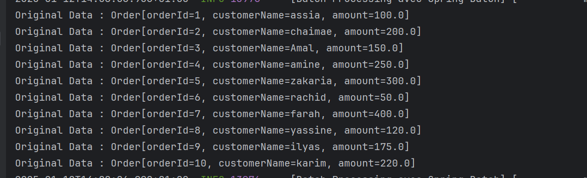
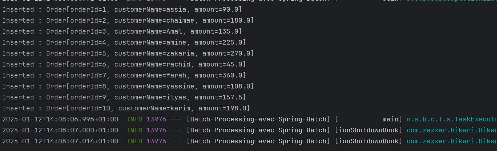

# Spring Batch - Traitement des Commandes

Ce projet utilise **Spring Batch** pour traiter une liste de commandes provenant d'un fichier CSV, appliquer une remise sur le montant de chaque commande, et enregistrer les commandes transformées dans une base de données HSQLDB.

## Objectifs

- Lire un fichier CSV contenant des commandes.
- Appliquer une remise de 10% sur le montant de chaque commande.
- Sauvegarder les commandes transformées dans une base de données.
- Afficher les commandes insérées à la fin du traitement.

## Structure du Projet

Le projet contient les éléments suivants :

1. **`orders.csv`** : Le fichier CSV contenant les commandes initiales.
2. **`schema.sql`** : Le script SQL pour créer la table `orders` dans la base de données.
3. **Classe `BatchConfiguration.java`** : Contient la configuration du job Spring Batch.
4. **Classe `OrderItemProcessor.java`** : Applique la remise sur le montant des commandes.
5. **Classe `JobCompletionListener.java`** : Affiche les commandes insérées après l'exécution du job.

## Prérequis

Avant d'exécuter ce projet, vous devez avoir les éléments suivants installés :

- **Java 21**
- **Spring Boot**
- **HSQLDB (base de données en mémoire)**

## Étapes pour exécuter le projet

### 1. Cloner le projet

Clonez ce dépôt Git sur votre machine locale : 
```bash
git clone https://github.com/assiaaitjeddi/batch-processing-avec-Spring-Batch.git
```

### 2. Préparer le fichier orders.csv
```bash
orderId,customerName,amount
1,assia,100.0
2,chaimae,200.0
3,Amal,150.0
4,amine,250.0
5,zakaria,300.0
6,rachid,50.0
7,farah,400.0
8,yassine,120.0
9,ilyas,175.0
10,karim,220.0
```

### 3. Créer la base de données et la table
```bash
CREATE TABLE orders (
orderId INT PRIMARY KEY,
customerName VARCHAR(100),
amount DOUBLE
);
```

### 4. Lancer l'application
Compilez et exécutez le projet Spring Boot :
./mvnw spring-boot:run

Le job Spring Batch lira les commandes du fichier CSV, appliquera la remise de 10% sur le montant, puis insérera les commandes mises à jour dans la base de données.

### 5. Visualiser les commandes insérées
Après l'exécution du job, les commandes insérées seront affichées dans les logs. Voici un exemple de sortie attendue :<br>

<br> <br> <br>  ```